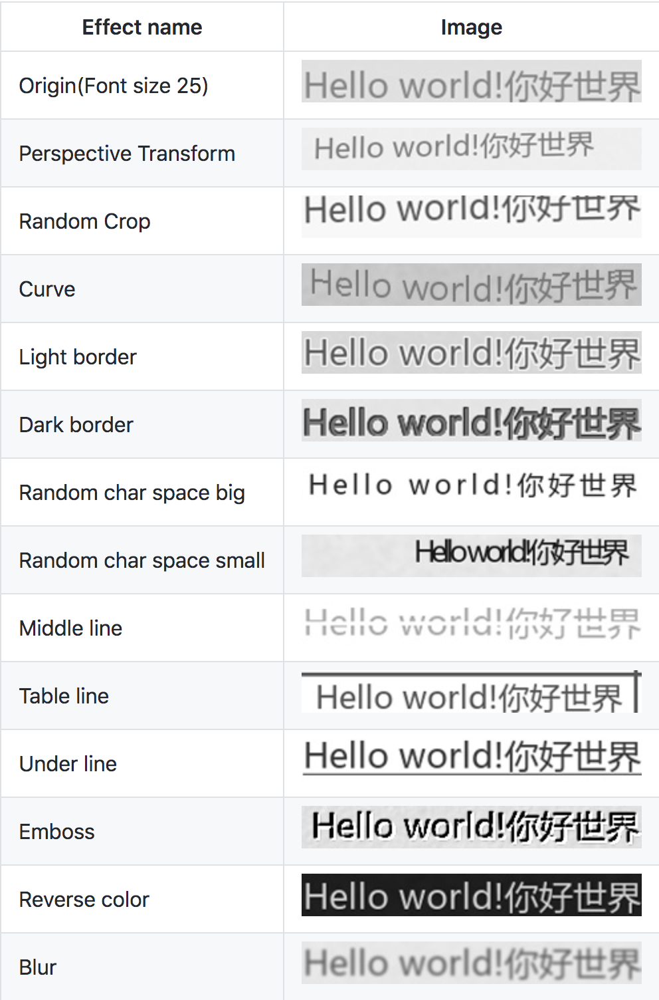

# Overview
A collection of projects to synthesise training data for OCR detection and recognition.

## Projects
  - [text-renderer](https://github.com/Sanster/text_renderer)
  该代码库的工程规范比较好，配置文件[configs/default.yaml](https://github.com/Sanster/text_renderer/blob/master/configs/default.yaml)、语料等分开存储，另外提供了检查字体是否支持所有字符的功能：[tools/check_font.py](https://github.com/Sanster/text_renderer/blob/master/tools/check_font.py).    
  支持多种变换：透视、随机裁剪、弯曲、边界、中线、模糊等等，效果如下所示：       
   <!-- .element height="30%" width="30%" -->
